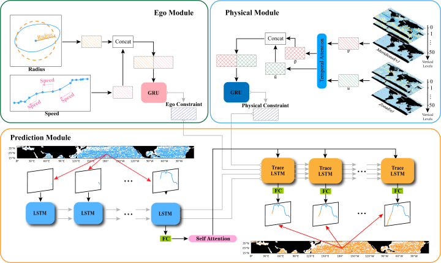

# Medium-range Trajectory Prediction Network Compliant to Physical Constraint for Oceanic Eddy

This paper proposed a novel neural network structure to achieve medium-range eddy trajectory prediction, named **ETPNet**, which is compliant with the physical constraint. This structure contains a variant of the long short-term memory (LSTM) cell, enhancing the dynamic interaction and representation ability of the features, constraints, and knowledge. The pipeline of the whole prediction framework is shown as follows:

<p align="center">
  
</p>

And the structure of the variant LSTM is illustrated as 

<p align="center">
  
</p>


## Experimental Results
| Method (MAGE Loss) |     MGD     |     SGD     |    MSE     |    MAE     |
| :----------------- | :---------: | :---------: | :--------: | :--------: |
| EGRU               |   45.9186   |  321.4303   |   0.1964   |   0.2766   |
| ELSTM              |   32.1280   |  224.8962   |   0.5132   |   0.1818   |
| Seq2Seq            |   40.5100   |  283.5702   |   0.1219   |   0.2452   |
| MSeq2Seq           |   12.5271   |   87.6897   |   0.0124   |   0.0757   |
| ETPNet-Ego         |   10.4589   |   73.2123   |   0.0088   |   0.0634   |
| ETPNet-Physical    |   10.6959   |   74.8712   |   0.0090   |   0.0646   |
| ETPNet             | **10.1715** | **71.2008** | **0.0085** | **0.0611** |

## Citing

if you find this work is helpful to your research, please consider citing our paper.

```latex
@article{10190732,
  author={Ge, Linyao and Huang, Baoxiang and Chen, Xiaoyan and Chen, Ge},
  journal={IEEE Transactions on Geoscience and Remote Sensing}, 
  title={Medium-Range Trajectory Prediction Network Compliant to Physical Constraint for Oceanic Eddy}, 
  year={2023},
  volume={61},
  number={},
  pages={1-14},
  doi={10.1109/TGRS.2023.3298020}
```
